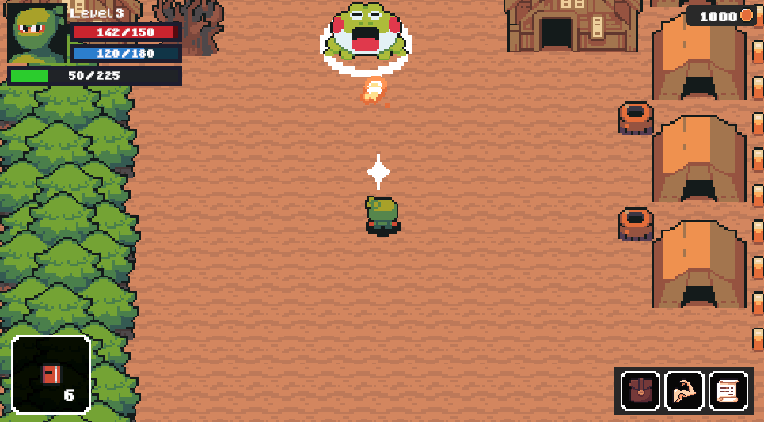
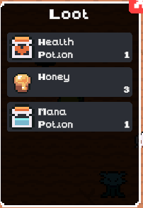
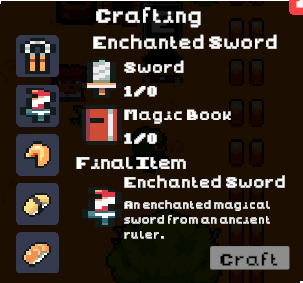
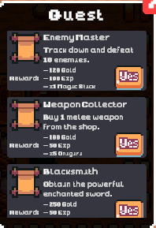
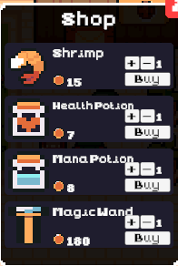
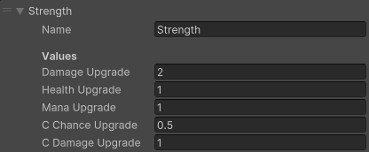
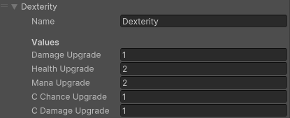
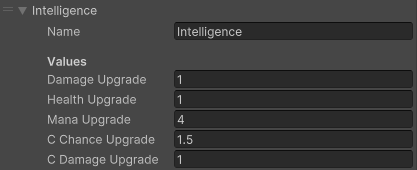
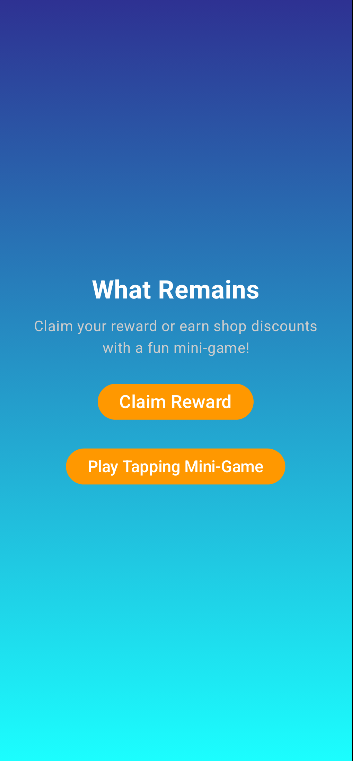
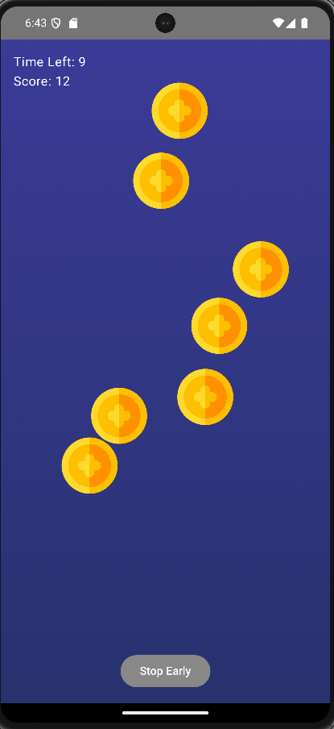

# What Remains

A 2D top-down singleplayer RPG built in Unity with a companion Android app.

## About

A young hero must restore a ruined town by clearing monsters, completing quests, and growing stronger. Features full RPG progression with combat, loot, crafting, and stat customization. A companion mobile app lets players earn rewards and shop discounts that sync to the main game.

## Features

### Game (Unity)
- **Combat** — Melee and magic weapons (swords, hammers, bows, wands, magic books)
- **Loot System** — Drop rates determine quantity and rarity
- **Crafting** — Combine reagents for unique weapons and consumables
- **Shops** — Buy items, affected by companion app discounts
- **Quests** — Multiple quest types with dialogue, rewards, and progression gating
- **NPCs** — Shopkeepers, craftsmen, quest givers, dialogue characters
- **Stat Progression** — Level up and allocate points to Strength, Dexterity, or Intelligence
- **Enemy AI** — FSM with Patrol/Wander, Chase, and Attack states based on proximity
- **Save/Load** — Persistent game state

### Companion App (Android)
- **Timed Rewards** — Claim 100 coins every 5 minutes
- **Tapping Mini-Game** — Score determines shop discount percentage
- **Sync** — Rewards and discounts apply in the main game

## Tech Stack

- **Game:** Unity 2D, C#
- **Companion App:** Android Studio, Kotlin
- **Server:** Node.js (deployed to Vercel)
- **Database:** MySQL
- **Architecture:** Scriptable Objects, FSM for AI, Queues (dialogue), Lists (inventory)

## Known Limitations

- Vertical slice — mechanics complete but content simplified due to time constraints
- Some UI/feedback polish needed
- Companion app functional but minimal

## Screenshots

<b>Gameplay</b>

  

<table>
  <tr>
    <td align="center" width="25%"><b>Loot</b></td>
    <td align="center" width="25%"><b>Crafting</b></td>
    <td align="center" width="25%"><b>Quests</b></td>
    <td align="center" width="25%"><b>Shop</b></td>
  </tr>
  <tr>
    <td></td>
    <td></td>
    <td></td>
    <td></td>
  </tr>
</table>

<table>
  <tr>
    <td align="center" width="33%"><b>Strength</b></td>
    <td align="center" width="33%"><b>Dexterity</b></td>
    <td align="center" width="33%"><b>Intelligence</b></td>
  </tr>
  <tr>
    <td></td>
    <td></td>
    <td></td>
  </tr>
</table>

<table>
  <tr>
    <td align="center" width="50%"><b>App Menu</b></td>
    <td align="center" width="50%"><b>Coins Minigame</b></td>
  </tr>
  <tr>
    <td align="center"></td>
    <td align="center"></td>
  </tr>
</table>

## License

This project was developed for academic purposes.
